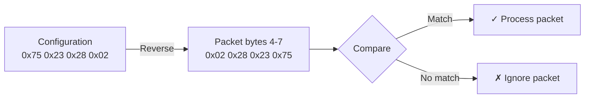
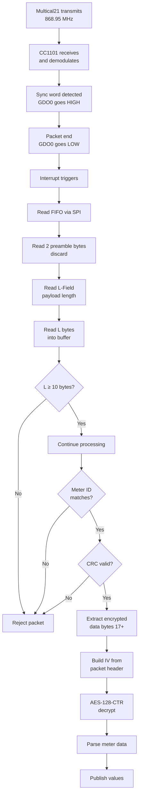
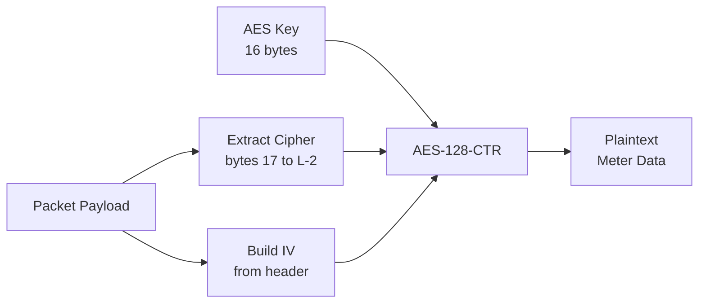
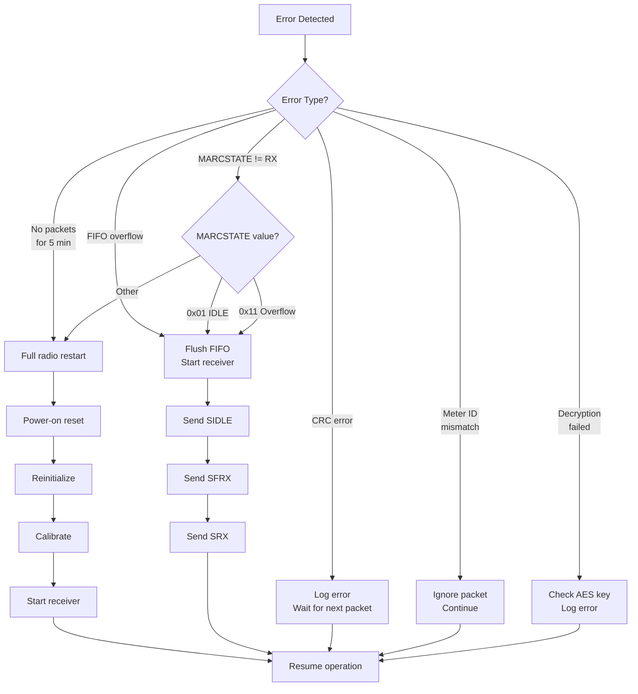

# Multical21 wMBUS Receiver - Complete Implementation Specification

**Version**: 1.0
**Target Hardware**: ESP32-C3 Super Mini + CC1101 Sub-GHz Radio
**Protocol**: wMBUS Mode C (868.95 MHz)
**Meter**: Kamstrup Multical21 Water Meter

---

## Table of Contents

1. [Hardware Configuration](#1-hardware-configuration)
2. [CC1101 Radio Configuration](#2-cc1101-radio-configuration)
3. [Initialization Procedure](#3-initialization-procedure)
4. [Packet Structure](#4-packet-structure)
5. [Reception Flow](#5-reception-flow)
6. [Packet Validation](#6-packet-validation)
7. [Decryption Process](#7-decryption-process)
8. [Data Parsing](#8-data-parsing)
9. [Data Output Specification](#9-data-output-specification)
10. [Error Handling](#10-error-handling)
11. [Complete Implementation Checklist](#11-complete-implementation-checklist)

---

## 1. Hardware Configuration

### 1.1 Components

**Microcontroller**: ESP32-C3 Super Mini
- Dual-core RISC-V processor
- Built-in WiFi/Bluetooth (optional for this application)
- SPI interface
- Multiple interrupt-capable GPIO pins

**Radio Module**: Texas Instruments CC1101
- Sub-1GHz RF Transceiver
- Frequency Range: 300-348 MHz, 387-464 MHz, 779-928 MHz
- Programmable data rate: 0.6 to 500 kbps
- Integrated packet handling engine
- 64-byte RX/TX FIFO

### 1.2 Physical Wiring

```
┌─────────────────────┐              ┌──────────────────┐
│   ESP32-C3 Super    │              │     CC1101       │
│       Mini          │              │   Radio Module   │
├─────────────────────┤              ├──────────────────┤
│                     │              │                  │
│  3.3V      ●────────┼──────────────┼────●  VCC        │
│  GND       ●────────┼──────────────┼────●  GND        │
│                     │              │                  │
│  GPIO 7    ●────────┼──────────────┼────●  CSN (CS)   │
│  GPIO 6    ●────────┼──────────────┼────●  MOSI (SI)  │
│  GPIO 5    ●────────┼──────────────┼────●  MISO (SO)  │
│  GPIO 4    ●────────┼──────────────┼────●  SCK (SCLK) │
│  GPIO 3    ●────────┼──────────────┼────●  GDO0       │
│                     │              │                  │
│                     │              │     GDO2  (NC)   │
└─────────────────────┘              └──────────────────┘

NC = Not Connected
```

**Pin Assignment Table**:

| Function | ESP32-C3 Pin | CC1101 Pin | Direction | Notes |
|----------|--------------|------------|-----------|-------|
| Power | 3.3V | VCC | Power | **Must be 3.3V** |
| Ground | GND | GND | Power | Common ground |
| Chip Select | GPIO 7 | CSN | Output | Active LOW |
| MOSI | GPIO 6 | SI/MOSI | Output | SPI data out |
| MISO | GPIO 5 | SO/MISO | Input | SPI data in |
| Clock | GPIO 4 | SCLK | Output | SPI clock |
| Interrupt | GPIO 3 | GDO0 | Input | Packet ready signal |
| Not Used | - | GDO2 | - | Leave floating |

**Critical Notes**:
- CC1101 is **NOT 5V tolerant** - must use 3.3V
- GPIO 3 must be interrupt-capable (all ESP32-C3 GPIOs support interrupts)
- SPI clock can run up to 10 MHz
- Recommended wire length: < 15 cm for reliability

---

## 2. CC1101 Radio Configuration

### 2.1 Target Radio Parameters

The CC1101 must be configured for **wMBUS Mode C1, TX** reception:

| Parameter | Value | Calculation/Notes |
|-----------|-------|-------------------|
| **Carrier Frequency** | 868.95 MHz | European wMBUS band |
| **Modulation** | 2-FSK | Binary Frequency Shift Keying |
| **Data Rate** | 100 kbps | Per EN 13757-4 standard |
| **Deviation** | ±50 kHz | Frequency deviation |
| **Channel Bandwidth** | ~270 kHz | RX filter bandwidth |
| **Sync Word** | 0x543D | wMBUS Mode C sync pattern |
| **Packet Format** | Variable length | Length byte in packet |
| **Preamble** | Minimal/None | wMBUS handles sync |

### 2.2 Frequency Calculation

The carrier frequency is set using three registers (FREQ2, FREQ1, FREQ0):

```
Formula: F_carrier = (F_XOSC / 2^16) × FREQ[23:0]

Where:
  F_XOSC = 26 MHz (CC1101 crystal frequency)
  FREQ[23:0] = 0x216BD0

Calculation:
  FREQ[23:0] = 0x21 6B D0 = 2,190,288 (decimal)
  F_carrier = (26,000,000 / 65,536) × 2,190,288
           = 396.728515625 × 2,190,288
           = 868,949,890 Hz
           ≈ 868.95 MHz ✓
```

### 2.3 Complete Register Configuration

**All values in hexadecimal**:

```
Register Map for wMBUS Mode C Reception
═══════════════════════════════════════

I/O CONFIGURATION
─────────────────
0x00  IOCFG2      0x2E    GDO2 output: high impedance
0x01  IOCFG1      [default] GDO1 not used
0x02  IOCFG0      0x06    GDO0: assert when sync word sent/received
                          deassert at end of packet

FIFO THRESHOLDS
───────────────
0x03  FIFOTHR     0x00    RX: 4 bytes, TX: 61 bytes

SYNC WORD (wMBUS Mode C)
────────────────────────
0x04  SYNC1       0x54    Sync word high byte
0x05  SYNC0       0x3D    Sync word low byte

PACKET CONFIGURATION
────────────────────
0x06  PKTLEN      0x30    Max packet length (48 bytes)
0x07  PKTCTRL1    0x00    No address check, no CRC autoflush
0x08  PKTCTRL0    0x02    Variable packet length mode
0x09  ADDR        0x00    Device address (unused)

FREQUENCY CONFIGURATION
───────────────────────
0x0A  CHANNR      0x00    Channel number
0x0B  FSCTRL1     0x08    IF frequency (Freq_IF = 304.687 kHz)
0x0C  FSCTRL0     0x00    Frequency offset (0)

0x0D  FREQ2       0x21    Frequency control word, high byte
0x0E  FREQ1       0x6B    Frequency control word, middle byte
0x0F  FREQ0       0xD0    Frequency control word, low byte
                          → 868.95 MHz

MODEM CONFIGURATION
───────────────────
0x10  MDMCFG4     0x5C    Channel bandwidth & data rate exponent
                          BW_channel ≈ 270 kHz
                          DRATE_E = 12

0x11  MDMCFG3     0x04    Data rate mantissa
                          DRATE_M = 4
                          Rate = 99.975 kbps ≈ 100 kbps

0x12  MDMCFG2     0x06    Modulation: 2-FSK
                          Sync mode: 15/16 sync word bits

0x13  MDMCFG1     0x22    FEC disabled, preamble bytes = 4
                          Channel spacing exponent = 2

0x14  MDMCFG0     0xF8    Channel spacing mantissa
                          Channel spacing ≈ 199.951 kHz

FREQUENCY DEVIATION
───────────────────
0x15  DEVIATN     0x44    Deviation: ±50.781 kHz ≈ ±50 kHz

STATE MACHINE
─────────────
0x16  MCSM2       [default] RX time not used
0x17  MCSM1       0x00    Stay in IDLE after RX/TX
0x18  MCSM0       0x18    Auto-calibrate when going from IDLE to RX/TX

FREQUENCY OFFSET COMPENSATION
─────────────────────────────
0x19  FOCCFG      0x2E    Frequency offset compensation config

BIT SYNCHRONIZATION
───────────────────
0x1A  BSCFG       0xBF    Bit synchronization config

AGC CONTROL
───────────
0x1B  AGCCTRL2    0x43    AGC target value, max gain
0x1C  AGCCTRL1    0x09    AGC control
0x1D  AGCCTRL0    0xB5    AGC filter, wait time

FRONT END CONFIGURATION
───────────────────────
0x21  FREND1      0xB6    Front end RX configuration
0x22  FREND0      0x10    Front end TX configuration

FREQUENCY SYNTHESIZER CALIBRATION
──────────────────────────────────
0x23  FSCAL3      0xEA    Frequency synthesizer calibration
0x24  FSCAL2      0x2A    Frequency synthesizer calibration
0x25  FSCAL1      0x00    Frequency synthesizer calibration
0x26  FSCAL0      0x1F    Frequency synthesizer calibration

TEST SETTINGS
─────────────
0x29  FSTEST      0x59    Frequency synthesizer test
0x2C  TEST2       0x81    Various test settings
0x2D  TEST1       0x35    Various test settings
0x2E  TEST0       0x09    Various test settings
```

---

## 3. Initialization Procedure

### 3.1 SPI Communication Basics

**SPI Mode**: Mode 0 (CPOL=0, CPHA=0)
- Clock idle state: LOW
- Data sampled on rising edge
- Data changed on falling edge

**Bit Order**: MSB first

**Address Byte Format**:
```
 7   6   5   4   3   2   1   0
┌───┬───┬───┬───┬───┬───┬───┬───┐
│R/W│ B │   5-bit Address       │
└───┴───┴───┴───┴───┴───┴───┴───┘

R/W: 0=Write, 1=Read
B:   0=Single byte, 1=Burst access

Examples:
  Write single register 0x0D: 0x0D (0000 1101)
  Read single register 0x35:  0xB5 (1011 0101) = 0x35 | 0x80
  Read burst from 0x3F:       0xFF (1111 1111) = 0x3F | 0xC0
```

**MISO Signal**:
- When CS is pulled low, MISO will be high until the CC1101 is ready
- Always wait for MISO to go LOW before sending data
- This indicates the CC1101 crystal oscillator is stable

### 3.2 Power-On Reset Sequence

```c
// Timing-critical sequence - follow exactly

1. Deassert CS (set HIGH)
   delay(3 microseconds)

2. Set MOSI = LOW
   Set SCK = HIGH
   // This ensures proper reset state per CC1101 datasheet section 11.3

3. Assert CS (set LOW)
   delay(3 microseconds)

4. Deassert CS (set HIGH)
   delay(45 microseconds)  // MINIMUM 40μs required

5. Assert CS (set LOW)
   Wait for MISO to go LOW (indicates crystal stable)

6. Send command strobe: 0x30 (SRES - Software Reset)
   Wait for MISO to go LOW again

7. Deassert CS (set HIGH)

// CC1101 is now in IDLE state with default register values
```

**Expected Result**: CC1101 in IDLE state, all registers at default values

### 3.3 Register Initialization

Write all registers from section 2.3 in sequence:

```python
# Pseudo-code for register initialization

registers = {
    0x00: 0x2E,  # IOCFG2
    0x02: 0x06,  # IOCFG0
    0x03: 0x00,  # FIFOTHR
    0x04: 0x54,  # SYNC1
    0x05: 0x3D,  # SYNC0
    0x06: 0x30,  # PKTLEN
    0x07: 0x00,  # PKTCTRL1
    0x08: 0x02,  # PKTCTRL0
    0x09: 0x00,  # ADDR
    0x0A: 0x00,  # CHANNR
    0x0B: 0x08,  # FSCTRL1
    0x0C: 0x00,  # FSCTRL0
    0x0D: 0x21,  # FREQ2
    0x0E: 0x6B,  # FREQ1
    0x0F: 0xD0,  # FREQ0
    0x10: 0x5C,  # MDMCFG4
    0x11: 0x04,  # MDMCFG3
    0x12: 0x06,  # MDMCFG2
    0x13: 0x22,  # MDMCFG1
    0x14: 0xF8,  # MDMCFG0
    0x15: 0x44,  # DEVIATN
    0x17: 0x00,  # MCSM1
    0x18: 0x18,  # MCSM0
    0x19: 0x2E,  # FOCCFG
    0x1A: 0xBF,  # BSCFG
    0x1B: 0x43,  # AGCCTRL2
    0x1C: 0x09,  # AGCCTRL1
    0x1D: 0xB5,  # AGCCTRL0
    0x21: 0xB6,  # FREND1
    0x22: 0x10,  # FREND0
    0x23: 0xEA,  # FSCAL3
    0x24: 0x2A,  # FSCAL2
    0x25: 0x00,  # FSCAL1
    0x26: 0x1F,  # FSCAL0
    0x29: 0x59,  # FSTEST
    0x2C: 0x81,  # TEST2
    0x2D: 0x35,  # TEST1
    0x2E: 0x09,  # TEST0
}

for address, value in registers.items():
    spi_write_register(address, value)
```

**Function: spi_write_register(address, value)**:
```python
def spi_write_register(address, value):
    assert_cs()                    # Pull CS LOW
    wait_for_miso_low()           # Wait for chip ready
    spi_transfer(address)          # Send register address (write bit = 0)
    spi_transfer(value)            # Send value to write
    deassert_cs()                  # Pull CS HIGH
```

### 3.4 Calibration

After writing all registers:

```python
# Send SCAL (calibrate) command
send_strobe_command(0x33)  # SCAL
delay(1 millisecond)       # Allow calibration to complete
```

**Function: send_strobe_command(cmd)**:
```python
def send_strobe_command(cmd):
    assert_cs()
    delay(5 microseconds)
    wait_for_miso_low()
    spi_transfer(cmd)      # Send command byte
    delay(5 microseconds)
    deassert_cs()
```

### 3.5 Start Receiver

```python
# Enter IDLE state
send_strobe_command(0x36)  # SIDLE

# Poll until in IDLE state
timeout_counter = 0
while read_status_register(0x35) != 0x01:  # MARCSTATE
    timeout_counter += 1
    if timeout_counter > 100:
        print("ERROR: Failed to enter IDLE state")
        restart_radio()  # Go back to section 3.2
        break
    delay(1 millisecond)

# Flush RX FIFO
send_strobe_command(0x3A)  # SFRX
delay(5 milliseconds)

# Enter RX state
send_strobe_command(0x34)  # SRX
delay(10 milliseconds)

# Poll until in RX state
timeout_counter = 0
while read_status_register(0x35) != 0x0D:  # MARCSTATE, RX = 0x0D
    timeout_counter += 1
    if timeout_counter > 100:
        print("ERROR: Failed to enter RX state")
        restart_radio()
        break
    delay(1 millisecond)

print("CC1101 ready for reception")
```

**Function: read_status_register(address)**:
```python
def read_status_register(address):
    addr_byte = address | 0xC0  # Burst bit | Read bit
    # IMPORTANT: Status registers (0x30-0x3D) MUST be read with burst bit set (0xC0)
    # This is different from configuration registers which use 0x80 for single read

    assert_cs()
    wait_for_miso_low()
    spi_transfer(addr_byte)
    value = spi_transfer(0x00)  # Read value
    deassert_cs()

    return value
```

### 3.6 Attach Interrupt Handler

```python
# Configure GDO0 (GPIO 3) as interrupt input
configure_gpio(3, INPUT)
attach_interrupt(
    pin=3,
    callback=packet_received_isr,
    trigger=FALLING_EDGE
)
```

**Interrupt Behavior**:
- GDO0 goes HIGH when sync word is detected
- GDO0 goes LOW at end of packet
- We trigger on FALLING edge (packet complete)

---

## 4. Packet Structure

### 4.1 Over-Air Packet Format

```
RF Transmission from Multical21 Meter
══════════════════════════════════════

┌──────────┬─────────┬──────────────────────────────────────┬─────────┐
│ Preamble │ L-Field │            Payload                   │   CRC   │
│ 2 bytes  │ 1 byte  │         L bytes                      │ 2 bytes │
└──────────┴─────────┴──────────────────────────────────────┴─────────┘
     │          │                    │                           │
     │          │                    │                           │
     └─ Varies  │                    │                           │
                │                    │                           │
     Length of payload (typically 30-80 bytes)                 │
                │                    │                           │
                └────────────────────┴───────────────────────────┘
                                     │
                           CRC calculated over these bytes
```

### 4.2 Detailed Packet Breakdown

**Bytes read from CC1101 FIFO**:

```
Byte Index  │ Field Name        │ Size    │ Description
────────────┼───────────────────┼─────────┼─────────────────────────────
[Preamble - not stored in application buffer]
0           │ L-Field           │ 1 byte  │ Length of following data
────────────┼───────────────────┼─────────┼─────────────────────────────
1           │ C-Field           │ 1 byte  │ Control field
2           │ M-Field[0]        │ 1 byte  │ Manufacturer ID (low)
3           │ M-Field[1]        │ 1 byte  │ Manufacturer ID (high)
4           │ A-Field[0]        │ 1 byte  │ Address - Serial number byte 3
5           │ A-Field[1]        │ 1 byte  │ Address - Serial number byte 2
6           │ A-Field[2]        │ 1 byte  │ Address - Serial number byte 1
7           │ A-Field[3]        │ 1 byte  │ Address - Serial number byte 0
8           │ A-Field[4]        │ 1 byte  │ Version
9           │ A-Field[5]        │ 1 byte  │ Device type
10          │ Reserved          │ 1 byte  │ Reserved / varies (NOT used in IV)
11          │ CI-Field          │ 1 byte  │ Control Information
12          │ Reserved          │ 1 byte  │ Reserved / varies
13          │ Access Number     │ 1 byte  │ Increments with each telegram
14          │ Status            │ 1 byte  │ Meter status byte
15          │ Configuration     │ 2 bytes │ Configuration word
16          │                   │         │
17          │ ┌─────────────────┴─────────┴──────────────────────────┐
            │ │         ENCRYPTED PAYLOAD (AES-128-CTR)              │
            │ │                                                       │
            │ │  This section contains the actual meter readings     │
            │ │  Length: L - 18 bytes (variable)                     │
            │ └───────────────────────────────────────────────────────┘
L-2         │ CRC High Byte     │ 1 byte  │ CRC16 (EN 13757-4)
L-1         │ CRC Low Byte      │ 1 byte  │
────────────┴───────────────────┴─────────┴─────────────────────────────

Total packet length in buffer: L + 1 bytes
(L-Field + L bytes of data)
```

### 4.3 Meter ID Validation

**Serial Number Location** (bytes 4-7, little-endian):

```
Example: Meter Serial Number = 02 28 23 75 (printed on device)

Stored in configuration as:      {0x75, 0x23, 0x28, 0x02}
Appears in packet at bytes 4-7:   [4]=0x02 [5]=0x28 [6]=0x23 [7]=0x75

Validation:
  if (packet[4] == config[3] &&
      packet[5] == config[2] &&
      packet[6] == config[1] &&
      packet[7] == config[0])
  {
      meter_id_matches = true;
  }
```



### 4.4 Packet Flow Diagram



---

## 5. Reception Flow

### 5.1 Main Loop Structure

```python
# Global state
packet_ready = False

def packet_received_isr():
    """Interrupt Service Routine - called on GDO0 falling edge"""
    global packet_ready
    packet_ready = True

def main_loop():
    """Call this continuously"""
    global packet_ready

    if packet_ready:
        # Disable interrupt during processing
        detach_interrupt(pin=3)

        # Clear flag
        packet_ready = False

        # Process the packet
        read_and_process_packet()

        # Restart receiver
        start_receiver()  # From section 3.5

        # Re-enable interrupt
        attach_interrupt(pin=3, callback=packet_received_isr,
                        trigger=FALLING_EDGE)

    # Other periodic tasks
    check_radio_health()  # Every 10 seconds
    check_timeout()       # Every loop iteration
```

### 5.2 Reading Packet from FIFO

```python
def read_and_process_packet():
    # Read preamble (for information, not used)
    preamble_1 = read_byte_from_fifo()
    preamble_2 = read_byte_from_fifo()

    # Read length field
    length = read_byte_from_fifo()

    if length > 64:
        print(f"ERROR: Invalid length {length}")
        return

    if length < 10:
        print(f"WARN: Packet too short {length}")
        return

    # Read payload
    payload = bytearray(length + 1)
    payload[0] = length

    for i in range(length):
        payload[i + 1] = read_byte_from_fifo()

    # Process the packet
    process_packet(payload, length)


def read_byte_from_fifo():
    """Read single byte from RX FIFO"""
    address = 0x3F | 0x80  # RXFIFO register, read single
    # IMPORTANT: RXFIFO (0x3F) must be read with READ_SINGLE (0x80), NOT READ_BURST
    # Each read consumes one byte from the FIFO

    assert_cs()
    wait_for_miso_low()
    spi_transfer(address)
    value = spi_transfer(0x00)
    deassert_cs()

    return value
```

### 5.3 Processing Timeline

```
Time Event
════ ═════════════════════════════════════════════════════════════
0 ms Packet transmission begins (from meter)
  │
  │  [Meter transmitting encrypted data over RF]
  │
~10ms Sync word detected → GDO0 goes HIGH
  │
  │  [Packet data being received into CC1101 FIFO]
  │
~30ms End of packet → GDO0 goes LOW → Interrupt fires
  │
+1ms ISR sets packet_ready flag and returns
  │
+2ms Main loop detects flag, disables interrupt
  │
+3ms Start reading FIFO via SPI (~1ms for typical packet)
  │
+4ms Validate meter ID (~0.1ms)
  │
+5ms Calculate and verify CRC (~0.5ms)
  │
+6ms Decrypt payload (~1-2ms for AES-128)
  │
+8ms Parse meter data (~0.1ms)
  │
+9ms Publish results (~variable, depends on output method)
  │
+10ms Restart receiver, re-enable interrupt
  │
DONE Ready for next packet
════ ═════════════════════════════════════════════════════════════

Total processing time: ~10ms
Next packet expected: 8-16 seconds later
```

---

## 6. Packet Validation

### 6.1 CRC Calculation (EN 13757-4 Standard)

**Algorithm**: EN13575 / CRC-16-EN-13757-4
- **Polynomial**: 0x3D65
- **Initial value**: 0x0000
- **Reflect input**: NO
- **Reflect output**: NO
- **Final XOR**: 0xFFFF

**Implementation**:

```python
def crc_en13575(data, length):
    """
    Calculate CRC-16 per EN 13757-4 standard

    Args:
        data: byte array
        length: number of bytes to calculate over
    Returns:
        16-bit CRC value
    """
    poly = 0x3D65
    crc = 0x0000

    # Initial CRC calculation
    for i in range(16):
        bit = crc & 1
        if bit:
            crc ^= poly
        crc >>= 1
        if bit:
            crc |= 0x8000

    # Process each byte
    for i in range(length):
        c = data[i]

        for j in range(7, -1, -1):  # Process bits 7 to 0
            bit = crc & 0x8000
            crc <<= 1
            if c & (1 << j):
                crc |= 1
            if bit:
                crc ^= poly

    # Final CRC calculation
    for i in range(16):
        bit = crc & 0x8000
        crc <<= 1
        if bit:
            crc ^= poly

    # Final XOR
    crc ^= 0xFFFF

    return crc & 0xFFFF
```

**Usage**:

```python
def verify_crc(payload, length):
    """
    Verify packet CRC

    Args:
        payload: packet buffer (payload[0] = L-field)
        length: value of L-field
    Returns:
        True if CRC valid, False otherwise
    """
    # Calculate CRC over payload[0] to payload[length-2]
    # (L-field + data, excluding the 2 CRC bytes at end)
    calculated_crc = crc_en13575(payload, length - 1)

    # Extract CRC from packet (last 2 bytes, big-endian)
    packet_crc = (payload[length - 1] << 8) | payload[length]

    if calculated_crc == packet_crc:
        return True
    else:
        print(f"CRC mismatch: calc=0x{calculated_crc:04X}, "
              f"packet=0x{packet_crc:04X}")
        return False
```

**Example**:
```
Payload (L=30):
  [0]=30 [1]=44 [2]=2D [3]=2C ... [28]=A3 [29]=F1 [30]=27

CRC calculation:
  Input: bytes [0] through [28] (29 bytes total)
  Calculated CRC: 0xF127
  Packet CRC: [29]=0xF1 [30]=0x27 → 0xF127
  Result: MATCH ✓
```

### 6.2 Validation Checklist

Before attempting decryption, verify:

```python
def validate_packet(payload, length):
    """
    Perform all validation checks
    Returns: (valid, error_message)
    """

    # 1. Length check
    if length < 10:
        return (False, f"Packet too short: {length} bytes")

    if length > 64:
        return (False, f"Packet too long: {length} bytes")

    # 2. Meter ID check (bytes 4-7 vs configured ID)
    meter_id_config = [0x75, 0x23, 0x28, 0x02]  # Your meter ID

    for i in range(4):
        if payload[7 - i] != meter_id_config[i]:
            packet_id = f"{payload[4]:02X}{payload[5]:02X}" \
                       f"{payload[6]:02X}{payload[7]:02X}"
            config_id = f"{meter_id_config[3]:02X}" \
                       f"{meter_id_config[2]:02X}" \
                       f"{meter_id_config[1]:02X}" \
                       f"{meter_id_config[0]:02X}"
            return (False, f"Meter ID mismatch: "
                          f"packet={packet_id} config={config_id}")

    # 3. CRC check
    if not verify_crc(payload, length):
        return (False, "CRC verification failed")

    # 4. Encryption length check
    cipher_length = length - 18  # Payload - header - CRC
    if cipher_length < 1:
        return (False, f"No encrypted data: cipher_len={cipher_length}")

    return (True, "OK")
```

---

## 7. Decryption Process

### 7.1 AES-128-CTR Mode

**Algorithm**: AES (Advanced Encryption Standard)
- **Mode**: CTR (Counter Mode)
- **Key size**: 128 bits (16 bytes)
- **Block size**: 128 bits (16 bytes)

**How to obtain your key**:
1. Contact your water utility company
2. Request the AES encryption key for your Multical21 meter
3. Provide your meter serial number
4. Key will be 16 bytes (32 hexadecimal characters)

**Example key format**:
```
As hex string: 4051D91B2498D62A9260D24BE8ED2361
As byte array: {0x40, 0x51, 0xD9, 0x1B, 0x24, 0x98, 0xD6, 0x2A,
                0x92, 0x60, 0xD2, 0x4B, 0xE8, 0xED, 0x23, 0x61}
```

### 7.2 Initialization Vector (IV) Construction

The IV is built from the packet header:

```
IV Structure (16 bytes total)
══════════════════════════════

Byte Index │ Source              │ Description
───────────┼─────────────────────┼────────────────────────────
0          │ payload[2]          │ M-field byte 0
1          │ payload[3]          │ M-field byte 1
2          │ payload[4]          │ A-field byte 0 (Serial[3])
3          │ payload[5]          │ A-field byte 1 (Serial[2])
4          │ payload[6]          │ A-field byte 2 (Serial[1])
5          │ payload[7]          │ A-field byte 3 (Serial[0])
6          │ payload[8]          │ A-field byte 4 (Version)
7          │ payload[9]          │ A-field byte 5 (Device type)
8          │ payload[11]         │ CI-field
9          │ payload[13]         │ Access number
10         │ payload[14]         │ Status
11         │ payload[15]         │ Configuration byte 0
12         │ payload[16]         │ Configuration byte 1
13         │ 0x00                │ Padding
14         │ 0x00                │ Padding
15         │ 0x00                │ Padding
───────────┴─────────────────────┴────────────────────────────
```

**Implementation**:

```python
def build_iv(payload):
    """
    Build AES-128-CTR initialization vector from packet header

    Args:
        payload: packet buffer
    Returns:
        16-byte IV array
    """
    iv = bytearray(16)

    # Bytes 0-7: M-field + A-field
    iv[0:8] = payload[2:10]

    # Byte 8: CI-field
    iv[8] = payload[11]

    # Bytes 9-12: Access number + Status + Configuration
    iv[9:13] = payload[13:17]

    # Bytes 13-15: Padding with zeros
    iv[13] = 0x00
    iv[14] = 0x00
    iv[15] = 0x00

    return iv
```

### 7.3 Decryption Process

```python
def decrypt_payload(payload, length, aes_key):
    """
    Decrypt the meter data

    Args:
        payload: packet buffer
        length: L-field value
        aes_key: 16-byte AES key
    Returns:
        decrypted plaintext (bytearray)
    """
    # 1. Calculate cipher length
    # The cipher starts at payload[17] and ends at payload[length-2]
    # Length calculation: Total length - header bytes (1-16) - CRC bytes (2)
    cipher_length = length - 16 - 2  # Same as: length - 18

    # Alternative calculation for clarity:
    # cipher_length = (length - 2) - 16
    # where (length - 2) is payload without CRC, and 16 is the header size

    # 2. Extract cipher data (starts at byte 17, after 16-byte header)
    cipher_data = payload[17:17 + cipher_length]

    # 3. Build IV
    iv = build_iv(payload)

    # 4. Initialize AES-128-CTR with key and IV
    aes_ctr = AES_CTR_128(key=aes_key, iv=iv)

    # 5. Decrypt
    plaintext = aes_ctr.decrypt(cipher_data)

    return plaintext
```

### 7.4 Decryption Diagram



**Example**:

```
Given:
  Packet length L = 45
  Cipher starts at byte 17
  Cipher length = 45 - 18 = 27 bytes

Cipher data:
  payload[17:44] = [DA 3F 12 8E ... 7B A3]

IV (built from header):
  [2D 2C 02 28 23 75 1B 06 72 0A 00 00 14 00 00 00]

AES Key (from utility):
  [40 51 D9 1B 24 98 D6 2A 92 60 D2 4B E8 ED 23 61]

Decrypt:
  plaintext = AES_CTR_Decrypt(cipher, key, iv)

Result plaintext:
  [0F 00 00 13 B7 E4 03 00 00 13 B7 E4 03 23 16 ...]
   │           │                 │           │  │
   Frame type  Total water       Target      Temps
```

---

## 8. Data Parsing

### 8.1 Frame Type Detection

The Multical21 sends two different frame formats. After decryption, the frame type can be determined by examining byte 2 of the decrypted plaintext, which serves as a frame format indicator.

**Frame Type Indicator Byte**: `plaintext[2]`
- Value `0x78`: Indicates long frame format
- Other values: Indicate compact frame format (most common)

```python
def detect_frame_type(plaintext):
    """
    Determine if frame is compact or long format

    Args:
        plaintext: decrypted payload (after AES-128-CTR decryption)
    Returns:
        "compact" or "long"
    """
    # Check frame format indicator at byte 2 of decrypted data
    if plaintext[2] == 0x78:
        return "long"
    else:
        return "compact"
```

### 8.2 Data Field Locations

**IMPORTANT**: The following byte positions refer to the **DECRYPTED PLAINTEXT** buffer (after AES-128-CTR decryption), NOT the original encrypted payload. These positions are indices into the plaintext array that results from decrypting the cipher data.

```
Data Field Positions in Decrypted Plaintext
══════════════════════════════════════════════════════════

Field           │ Compact Frame │ Long Frame │ Size    │ Unit
────────────────┼───────────────┼────────────┼─────────┼────────
Info Codes      │     7         │     6      │ 1 byte  │ Flags
Total Water     │   9-12        │  10-13     │ 4 bytes │ Liters
Target Water    │  13-16        │  16-19     │ 4 bytes │ Liters
Flow Temp       │    17         │    22      │ 1 byte  │ °C
Ambient Temp    │    18         │    25      │ 1 byte  │ °C
────────────────┴───────────────┴────────────┴─────────┴────────
```

### 8.3 Complete Parsing Implementation

```python
def parse_meter_data(plaintext):
    """
    Extract all meter readings from decrypted data

    Args:
        plaintext: decrypted payload
    Returns:
        dict with meter values
    """
    # Detect frame type
    frame_type = detect_frame_type(plaintext)

    # Set positions based on frame type
    if frame_type == "long":
        pos_info_codes = 6
        pos_total = 10
        pos_target = 16
        pos_flow_temp = 22
        pos_ambient_temp = 25
    else:  # compact
        pos_info_codes = 7
        pos_total = 9
        pos_target = 13
        pos_flow_temp = 17
        pos_ambient_temp = 18

    # Extract total water consumption (4 bytes, little-endian)
    total_liters = (plaintext[pos_total] |
                   (plaintext[pos_total + 1] << 8) |
                   (plaintext[pos_total + 2] << 16) |
                   (plaintext[pos_total + 3] << 24))
    total_m3 = total_liters / 1000.0

    # Extract target water consumption (4 bytes, little-endian)
    target_liters = (plaintext[pos_target] |
                    (plaintext[pos_target + 1] << 8) |
                    (plaintext[pos_target + 2] << 16) |
                    (plaintext[pos_target + 3] << 24))
    target_m3 = target_liters / 1000.0

    # Extract temperatures (signed bytes)
    flow_temp_c = plaintext[pos_flow_temp]
    if flow_temp_c > 127:
        flow_temp_c = flow_temp_c - 256  # Handle signed

    ambient_temp_c = plaintext[pos_ambient_temp]
    if ambient_temp_c > 127:
        ambient_temp_c = ambient_temp_c - 256  # Handle signed

    # Extract info codes
    info_codes = plaintext[pos_info_codes]

    return {
        'frame_type': frame_type,
        'total_m3': total_m3,
        'target_m3': target_m3,
        'flow_temp_c': flow_temp_c,
        'ambient_temp_c': ambient_temp_c,
        'info_codes': info_codes,
        'info_codes_text': decode_info_codes(info_codes)
    }
```

### 8.4 Info Codes Interpretation

```python
def decode_info_codes(code):
    """
    Decode meter status info codes

    Args:
        code: info code byte
    Returns:
        human-readable string
    """
    codes = {
        0x00: "normal",
        0x01: "dry",           # No water detected
        0x02: "reverse",       # Reverse flow detected
        0x04: "leak",          # Leak detected
        0x08: "burst",         # Pipe burst detected
    }

    if code in codes:
        return codes[code]
    else:
        return f"unknown_0x{code:02X}"
```

**Info Code Details**:

| Code | Name | Description | Action Required |
|------|------|-------------|-----------------|
| 0x00 | Normal | Meter operating normally | None |
| 0x01 | Dry | No water flow detected for extended period | Check water supply |
| 0x02 | Reverse | Water flowing backwards | Check for backflow, possible plumbing issue |
| 0x04 | Leak | Continuous low flow detected | Inspect for leaks |
| 0x08 | Burst | Sudden high flow detected | Check for pipe burst, close main valve |

### 8.5 Complete Processing Example

```python
def process_packet(payload, length):
    """
    Complete packet processing pipeline

    Args:
        payload: packet buffer from FIFO
        length: L-field value
    """
    # 1. Validate
    valid, error_msg = validate_packet(payload, length)
    if not valid:
        print(f"Packet validation failed: {error_msg}")
        return

    # 2. Decrypt
    aes_key = bytes([0x40, 0x51, 0xD9, 0x1B, 0x24, 0x98, 0xD6, 0x2A,
                     0x92, 0x60, 0xD2, 0x4B, 0xE8, 0xED, 0x23, 0x61])

    try:
        plaintext = decrypt_payload(payload, length, aes_key)
    except Exception as e:
        print(f"Decryption failed: {e}")
        return

    # 3. Parse
    try:
        data = parse_meter_data(plaintext)
    except Exception as e:
        print(f"Parsing failed: {e}")
        return

    # 4. Display/publish
    print(f"Meter Reading ({data['frame_type']} frame):")
    print(f"  Total consumption: {data['total_m3']:.3f} m³")
    print(f"  Target consumption: {data['target_m3']:.3f} m³")
    print(f"  Flow temperature: {data['flow_temp_c']}°C")
    print(f"  Ambient temperature: {data['ambient_temp_c']}°C")
    print(f"  Status: {data['info_codes_text']}")

    # 5. Send to MQTT/other output
    publish_to_mqtt(data)
```

---

## 9. Data Output Specification

This section defines the complete set of data points available from the Multical21 meter, their formats, units, and semantic meanings. This information is protocol-agnostic and can be used to implement output to any system (MQTT, REST API, database, etc.).

### 9.1 Available Data Points

The following table lists all extractable data points from successfully processed packets:

| Data Point ID | Name | Data Type | Unit | Range | Update Frequency | Description |
|---------------|------|-----------|------|-------|------------------|-------------|
| `total_consumption` | Total Water Consumption | Float | m³ (cubic meters) | 0 to 999,999.999 | Every packet (8-16s) | Cumulative water consumption since meter installation |
| `target_consumption` | Target Water Consumption | Float | m³ (cubic meters) | 0 to 999,999.999 | Every packet (8-16s) | Target/reference consumption value |
| `flow_temperature` | Flow Temperature | Integer | °C (Celsius) | -128 to +127 | Every packet (8-16s) | Temperature of water flowing through meter |
| `ambient_temperature` | Ambient Temperature | Integer | °C (Celsius) | -128 to +127 | Every packet (8-16s) | Temperature around meter housing |
| `info_code` | Status Info Code | Integer (enum) | - | 0x00 to 0xFF | Every packet (8-16s) | Meter status/error flags |
| `info_code_text` | Status Text | String (enum) | - | - | Every packet (8-16s) | Human-readable status |
| `frame_type` | Frame Format | String (enum) | - | "compact" or "long" | Every packet (8-16s) | Packet format used |
| `rssi` | Signal Strength | Integer | dBm | -120 to 0 | Every packet (8-16s) | RF signal strength (from CC1101) |
| `packet_count` | Packets Received | Integer (counter) | packets | 0 to ∞ | Cumulative | Total successful packets decoded |
| `error_count` | Errors | Integer (counter) | errors | 0 to ∞ | Cumulative | Failed packet count (CRC, validation) |

### 9.2 Data Point Details

#### 9.2.1 Total Water Consumption

**Identifier**: `total_consumption`
**Native Format**: 32-bit unsigned integer (little-endian)
**Native Unit**: Liters
**Output Unit**: Cubic meters (m³)
**Precision**: 3 decimal places (0.001 m³ = 1 liter)

**Extraction & Conversion**:
```python
# From plaintext buffer (compact frame)
total_liters = (plaintext[9] |
               (plaintext[10] << 8) |
               (plaintext[11] << 16) |
               (plaintext[12] << 24))

# Convert to cubic meters
total_m3 = total_liters / 1000.0

# Format for output (3 decimal places)
output_value = f"{total_m3:.3f}"  # e.g., "123.456"
```

**Characteristics**:
- **Monotonic**: Value should only increase (never decrease)
- **Resolution**: 1 liter (0.001 m³)
- **Rollover**: Extremely rare (999,999.999 m³ = 999,999,999 liters)
- **State Class**: `total_increasing` (for statistical systems)
- **Icon Suggestion**: Water drop, water meter

**Validation**:
- Check that new value ≥ previous value (allow small decreases due to meter recalibration)
- Typical household consumption: 50-200 m³/year (0.15-0.55 m³/day)
- Alert if daily increase > 10 m³ (possible leak)

#### 9.2.2 Target Water Consumption

**Identifier**: `target_consumption`
**Native Format**: 32-bit unsigned integer (little-endian)
**Native Unit**: Liters
**Output Unit**: Cubic meters (m³)
**Precision**: 3 decimal places

**Extraction & Conversion**: (same as total_consumption, different offset)
```python
# From plaintext buffer (compact frame)
target_liters = (plaintext[13] |
                (plaintext[14] << 8) |
                (plaintext[15] << 16) |
                (plaintext[16] << 24))

target_m3 = target_liters / 1000.0
output_value = f"{target_m3:.3f}"
```

**Characteristics**:
- **Purpose**: Reference/target consumption for comparison
- **Relation to Total**: Usually equals or closely follows `total_consumption`
- **State Class**: `total` (for statistical systems)
- **Icon Suggestion**: Water outline, target

**Validation**:
- Typically within 0.1 m³ of total_consumption
- If significantly different, may indicate meter configuration mode

#### 9.2.3 Flow Temperature

**Identifier**: `flow_temperature`
**Native Format**: 8-bit signed integer
**Unit**: Degrees Celsius (°C)
**Precision**: 1°C (integer values only)

**Extraction**:
```python
# From plaintext buffer (compact frame)
flow_temp_raw = plaintext[17]

# Handle signed byte
if flow_temp_raw > 127:
    flow_temp_c = flow_temp_raw - 256
else:
    flow_temp_c = flow_temp_raw

output_value = flow_temp_c  # e.g., 18
```

**Characteristics**:
- **Range**: -128°C to +127°C (practical: 0°C to 40°C for water systems)
- **Typical Values**:
  - Cold water: 5-15°C
  - Room temperature water: 15-25°C
  - Warm water: 25-40°C
- **State Class**: `measurement` (instantaneous reading)
- **Device Class**: `temperature` (for HA/similar systems)

**Validation**:
- Alert if < 0°C (frozen pipes risk)
- Alert if > 40°C (unexpected for cold water meter)
- Changes should be gradual (< 5°C/minute normally)

#### 9.2.4 Ambient Temperature

**Identifier**: `ambient_temperature`
**Native Format**: 8-bit signed integer
**Unit**: Degrees Celsius (°C)
**Precision**: 1°C (integer values only)

**Extraction**: (same as flow_temperature, different offset)
```python
# From plaintext buffer (compact frame)
ambient_temp_raw = plaintext[18]

if ambient_temp_raw > 127:
    ambient_temp_c = ambient_temp_raw - 256
else:
    ambient_temp_c = ambient_temp_raw

output_value = ambient_temp_c
```

**Characteristics**:
- **Typical Values**: Indoor installation: 15-25°C, Outdoor: -20°C to +35°C
- **State Class**: `measurement`
- **Device Class**: `temperature`

**Validation**:
- Alert if < 0°C for indoor installations (potential freezing)
- Should correlate with environmental temperature

#### 9.2.5 Info Code (Status Flags)

**Identifier**: `info_code`
**Native Format**: 8-bit unsigned integer (bitmask/enum)
**Unit**: Dimensionless
**Precision**: 1 (integer)

**Extraction**:
```python
# From plaintext buffer (compact frame)
info_code = plaintext[7]

output_value = info_code  # Raw numeric value
```

**Defined Values**:

| Code (hex) | Code (decimal) | Name | Severity | Description |
|------------|----------------|------|----------|-------------|
| 0x00 | 0 | Normal | Info | Meter operating normally |
| 0x01 | 1 | Dry | Warning | No water flow detected for extended period |
| 0x02 | 2 | Reverse | Warning | Water flowing backwards through meter |
| 0x04 | 4 | Leak | Alert | Continuous low flow suggesting leak |
| 0x08 | 8 | Burst | Critical | Sudden high flow suggesting pipe burst |

**Text Mapping**:
```python
def decode_info_code(code):
    """Convert numeric code to human-readable text"""
    codes = {
        0x00: "normal",
        0x01: "dry",
        0x02: "reverse",
        0x04: "leak",
        0x08: "burst",
    }
    return codes.get(code, f"unknown_0x{code:02X}")
```

**Characteristics**:
- **State Class**: Not applicable (categorical state)
- **Icon Suggestions**:
  - 0x00: Check mark, status OK
  - 0x01: Water off
  - 0x02: Arrow reverse
  - 0x04: Water alert
  - 0x08: Alert/warning

**Automation Suggestions**:
- **0x01 (Dry)**: Check if water main is shut off, notification to user
- **0x02 (Reverse)**: Inspect plumbing for backflow issues
- **0x04 (Leak)**: Alert homeowner, check for dripping faucets, running toilets
- **0x08 (Burst)**: Critical alert, suggest closing main valve, call plumber

#### 9.2.6 Info Code Text

**Identifier**: `info_code_text`
**Format**: String (enumerated)
**Unit**: N/A

**Possible Values**:
- `"normal"` - Standard operation
- `"dry"` - No water flow
- `"reverse"` - Reverse flow
- `"leak"` - Leak detected
- `"burst"` - Burst detected
- `"unknown_0xXX"` - Unrecognized code (XX = hex value)

**Extraction**: Derived from `info_code` using mapping function (see 9.2.5)

### 9.3 Derived/Calculated Data Points

These data points can be calculated from the base measurements:

#### 9.3.1 Consumption Rate (Flow Rate)

**Calculation**:
```python
# Calculate liters per hour
time_delta_hours = (current_time - previous_time) / 3600.0
consumption_delta_liters = (current_total_liters - previous_total_liters)
flow_rate_lph = consumption_delta_liters / time_delta_hours

# Convert to liters per minute
flow_rate_lpm = flow_rate_lph / 60.0

# Convert to cubic meters per hour
flow_rate_m3h = flow_rate_lph / 1000.0
```

**Units**:
- Liters per hour (L/h)
- Liters per minute (L/min)
- Cubic meters per hour (m³/h)

**Typical Values**:
- Idle (no flow): 0 L/h
- Small drip leak: 0.5-5 L/h
- Single tap running: 300-600 L/h (5-10 L/min)
- Shower: 300-900 L/h (5-15 L/min)
- Major leak: > 1000 L/h

**Validation**:
- Require minimum time delta (60 seconds) for accurate calculation
- Household peak flow rarely exceeds 1500 L/h

#### 9.3.2 Daily Consumption

**Calculation**:
```python
# At end of each day (midnight)
daily_consumption = total_today_m3 - total_yesterday_m3
```

**Unit**: Cubic meters (m³)

**Typical Values**:
- Single person: 0.1-0.2 m³/day (100-200 liters)
- Family of 4: 0.4-0.8 m³/day (400-800 liters)
- Alert threshold: > 2.0 m³/day (possible leak)

#### 9.3.3 Connection Status

**Calculation**:
```python
time_since_last_packet = current_time - last_successful_packet_time

if time_since_last_packet < 30:  # seconds
    status = "online"
elif time_since_last_packet < 300:  # 5 minutes
    status = "stale"
else:
    status = "offline"
```

**Values**: `"online"`, `"stale"`, `"offline"`

**Thresholds**:
- Online: < 30 seconds since last packet
- Stale: 30s - 5 minutes
- Offline: > 5 minutes

### 9.4 Data Quality & Reliability

#### 9.4.1 Packet Reception Statistics

Track these metrics for system health:

```python
class MeterStatistics:
    packets_received: int = 0       # Total packets received
    packets_valid: int = 0          # Packets that passed all validation
    packets_crc_failed: int = 0     # CRC check failures
    packets_id_mismatch: int = 0    # Wrong meter ID
    packets_decrypt_failed: int = 0 # Decryption failures

    # Derived metrics
    def success_rate(self):
        if self.packets_received == 0:
            return 0.0
        return (self.packets_valid / self.packets_received) * 100.0

    def error_rate(self):
        return 100.0 - self.success_rate()
```

**Expected Performance**:
- Success rate: > 95%
- CRC failures: < 3% (usually due to weak signal)
- ID mismatches: Variable (depends on nearby meters)

#### 9.4.2 Signal Quality

**RSSI (Received Signal Strength Indicator)**:
```python
# Read from CC1101 register 0x34
rssi_raw = read_status_register(0x34)

# Convert to dBm
if rssi_raw >= 128:
    rssi_dbm = (rssi_raw - 256) / 2 - 74
else:
    rssi_dbm = rssi_raw / 2 - 74
```

**RSSI Interpretation**:
| Range (dBm) | Quality | Expected Behavior |
|-------------|---------|-------------------|
| -40 to -60 | Excellent | 99%+ packet success rate |
| -60 to -80 | Good | 95-99% success rate |
| -80 to -95 | Fair | 85-95% success rate |
| -95 to -105 | Poor | 70-85% success rate |
| < -105 | Very Poor | < 70% success rate |

### 9.5 Data Formatting for Integration

#### 9.5.1 JSON Output Example

Complete data point set in JSON format:

```json
{
  "device": {
    "serial_number": "02282375",
    "meter_type": "Multical21",
    "firmware_version": "1.0.0"
  },
  "timestamp": "2025-01-15T14:32:18Z",
  "measurements": {
    "total_consumption": {
      "value": 123.456,
      "unit": "m³",
      "precision": 3
    },
    "target_consumption": {
      "value": 123.456,
      "unit": "m³",
      "precision": 3
    },
    "flow_temperature": {
      "value": 18,
      "unit": "°C"
    },
    "ambient_temperature": {
      "value": 22,
      "unit": "°C"
    },
    "status": {
      "info_code": 0,
      "info_code_text": "normal",
      "severity": "info"
    }
  },
  "derived": {
    "flow_rate": {
      "value": 5.2,
      "unit": "L/min"
    },
    "daily_consumption": {
      "value": 0.452,
      "unit": "m³"
    }
  },
  "diagnostics": {
    "rssi": {
      "value": -72,
      "unit": "dBm"
    },
    "packet_count": 1523,
    "success_rate": 97.3,
    "last_error": "none",
    "uptime_seconds": 86400
  }
}
```

#### 9.5.2 Minimal Output Example

For constrained systems, minimum useful data set:

```json
{
  "total": 123.456,
  "temp": 18,
  "status": "normal",
  "rssi": -72
}
```

#### 9.5.3 Database Schema Suggestion

For SQL-based logging:

```sql
CREATE TABLE meter_readings (
    id SERIAL PRIMARY KEY,
    timestamp TIMESTAMP NOT NULL DEFAULT NOW(),
    meter_id VARCHAR(20) NOT NULL,
    total_consumption_m3 DECIMAL(10,3) NOT NULL,
    target_consumption_m3 DECIMAL(10,3),
    flow_temperature_c SMALLINT,
    ambient_temperature_c SMALLINT,
    info_code SMALLINT NOT NULL,
    info_code_text VARCHAR(20),
    rssi_dbm SMALLINT,
    frame_type VARCHAR(10),
    INDEX idx_timestamp (timestamp),
    INDEX idx_meter_id (meter_id)
);
```

#### 9.5.4 Time-Series Database Tags

For InfluxDB, Prometheus, or similar:

```
Measurement: water_meter
Tags:
  - meter_id: "02282375"
  - location: "basement"
  - meter_type: "multical21"

Fields:
  - total_consumption_m3: 123.456 (float)
  - flow_temperature_c: 18 (integer)
  - ambient_temperature_c: 22 (integer)
  - info_code: 0 (integer)
  - rssi_dbm: -72 (integer)
  - packet_count: 1523 (integer)
```

### 9.6 Update Characteristics

**Transmission Interval**:
- Nominal: 8-16 seconds
- Actual: Variable based on meter configuration
- Missed packets: Expected due to RF environment

**Latency Budget**:
- Meter transmission: 0ms (reference point)
- RF propagation: < 1ms
- Packet reception: 30ms
- Processing (decrypt + parse): 10ms
- Output formatting: 1-5ms
- **Total latency**: < 50ms from transmission to data availability

**Data Freshness**:
- Data age when published: < 1 second
- Consider data stale if: > 30 seconds old
- Consider connection lost if: > 5 minutes old

### 9.7 Integration Guidelines

When implementing output to any system:

1. **Numeric Precision**:
   - Store consumption values as floats with 3 decimal places
   - Store temperatures as integers
   - Store RSSI as integer

2. **Units**:
   - Always include units in metadata or field names
   - Use SI units (m³, °C) unless system requires otherwise
   - Document any unit conversions

3. **State Classification**:
   - `total_consumption`: Cumulative, monotonically increasing
   - `target_consumption`: Cumulative total
   - Temperatures: Instantaneous measurements
   - `info_code`: Categorical state
   - Diagnostics: Varies by metric

4. **Null Handling**:
   - If packet processing fails, publish diagnostic status but not stale data
   - Consider using "unknown" or null for unavailable readings

5. **Rate Limiting**:
   - Don't publish more frequently than packets arrive (8-16s)
   - Consider publishing only on value changes for consumption

6. **Timestamps**:
   - Use packet reception time, not processing completion time
   - Include timezone or use UTC

7. **Error Reporting**:
   - Publish connection status separately from measurements
   - Include error counters and success rate in diagnostics
   - Alert on prolonged offline status (> 5 minutes)

---

## 10. Error Handling

### 10.1 Radio Health Monitoring

```python
import time

# State variables
last_packet_time = time.time()
last_health_check = time.time()

RECEIVE_TIMEOUT = 300  # 5 minutes in seconds
HEALTH_CHECK_INTERVAL = 10  # 10 seconds

def check_timeout():
    """
    Check if we haven't received packets for too long
    Call this in every main loop iteration
    """
    global last_packet_time

    if (time.time() - last_packet_time) > RECEIVE_TIMEOUT:
        print("ERROR: No packets received for 5 minutes")
        print("Restarting radio...")
        restart_radio()
        last_packet_time = time.time()

def check_radio_health():
    """
    Periodic radio health check
    Call this every 10 seconds
    """
    global last_health_check

    if (time.time() - last_health_check) < HEALTH_CHECK_INTERVAL:
        return

    last_health_check = time.time()

    # Read status registers
    marcstate = read_status_register(0x35)  # MARCSTATE
    rxbytes = read_status_register(0x3B)    # RXBYTES
    rssi = read_status_register(0x34)       # RSSI

    # Calculate RSSI in dBm
    if rssi >= 128:
        rssi_dbm = (rssi - 256) / 2 - 74
    else:
        rssi_dbm = rssi / 2 - 74

    print(f"Radio health: MARC=0x{marcstate:02X}, "
          f"RXbytes={rxbytes & 0x7F}, RSSI={rssi_dbm:.0f}dBm")

    # Check if in correct state
    if marcstate != 0x0D:  # Should be in RX state
        print(f"WARNING: Not in RX mode (state=0x{marcstate:02X})")
        print("Restarting receiver...")
        start_receiver()

    # Check for FIFO overflow
    if rxbytes & 0x80:  # Bit 7 set = overflow
        print("ERROR: RX FIFO overflow detected")
        print("Restarting receiver...")
        start_receiver()

def restart_radio():
    """
    Complete radio restart (from power-on reset)
    """
    print("Performing complete radio restart...")

    # Go through full initialization sequence
    power_on_reset()           # Section 3.2
    write_all_registers()      # Section 3.3
    calibrate()                # Section 3.4
    start_receiver()           # Section 3.5

    print("Radio restart complete")
```

### 10.2 MARCSTATE Values Reference

When checking radio state, these are the possible MARCSTATE values:

| Value | Name | Meaning |
|-------|------|---------|
| 0x00 | SLEEP | Sleep state |
| 0x01 | IDLE | Idle state |
| 0x0D | RX | Receive mode (normal operating state) |
| 0x0E | RX_END | End of packet |
| 0x0F | RX_RST | RX termination |
| 0x11 | RXFIFO_OVERFLOW | FIFO overflow (ERROR) |
| 0x13 | TX | Transmit mode |
| 0x16 | TXFIFO_UNDERFLOW | FIFO underflow (ERROR) |

**Expected state during normal operation**: 0x0D (RX)

### 10.3 Error Recovery Decision Tree



### 10.4 Debugging Output

```python
def debug_packet(payload, length, level=1):
    """
    Print debug information about packet

    Args:
        payload: packet buffer
        length: L-field value
        level: 0=errors only, 1=normal, 2=verbose
    """
    if level >= 1:
        print(f"\n=== Packet Debug (L={length}) ===")

        # Print raw packet
        print("Raw payload:")
        for i in range(min(length + 1, 64)):
            if i % 16 == 0:
                print(f"\n  [{i:2d}]: ", end="")
            print(f"{payload[i]:02X} ", end="")
        print()

        # Meter ID
        print(f"\nMeter ID: {payload[4]:02X}{payload[5]:02X}"
              f"{payload[6]:02X}{payload[7]:02X}")

        # CRC
        packet_crc = (payload[length - 1] << 8) | payload[length]
        calc_crc = crc_en13575(payload, length - 1)
        print(f"CRC: packet=0x{packet_crc:04X}, "
              f"calculated=0x{calc_crc:04X} ", end="")
        print("✓" if packet_crc == calc_crc else "✗")

    if level >= 2:
        # Detailed header analysis
        print("\nHeader fields:")
        print(f"  C-Field: 0x{payload[1]:02X}")
        print(f"  M-Field: 0x{payload[2]:02X}{payload[3]:02X}")
        print(f"  CI-Field: 0x{payload[11]:02X}")
        print(f"  Access#: {payload[13]}")
        print(f"  Status: 0x{payload[14]:02X}")
        print(f"  Config: 0x{payload[15]:02X}{payload[16]:02X}")

        # Cipher info
        cipher_len = length - 18
        print(f"\nCipher data: {cipher_len} bytes at offset 17")
```

---

## 11. Complete Implementation Checklist

### 11.1 Hardware Setup

- [ ] ESP32-C3 Super Mini board acquired
- [ ] CC1101 radio module acquired (868 MHz version)
- [ ] Wired connections per section 1.2:
  - [ ] Power: 3.3V and GND
  - [ ] SPI: CS=GPIO7, MOSI=GPIO6, MISO=GPIO5, SCK=GPIO4
  - [ ] Interrupt: GDO0=GPIO3
- [ ] Visual inspection: all solder joints good, no shorts
- [ ] Multimeter check: 3.3V present at CC1101 VCC pin

### 11.2 Configuration Data

- [ ] Obtained AES encryption key from water utility (16 bytes)
- [ ] Meter serial number recorded (4 bytes from meter label)
- [ ] Serial number stored in little-endian format in code
- [ ] Example: If meter shows "02282375", store as {0x75, 0x23, 0x28, 0x02}

### 11.3 Software Implementation - Core Functions

- [ ] SPI driver initialized (mode 0, MSB first, up to 10 MHz)
- [ ] GPIO initialization (CS as output, MISO as input, GDO0 as interrupt input)
- [ ] Power-on reset sequence (section 3.2)
- [ ] Register write function (section 3.3)
- [ ] All 33 CC1101 registers configured per section 2.3
- [ ] Calibration command sent (section 3.4)
- [ ] Start receiver function (section 3.5)
- [ ] Interrupt handler attached to GDO0, falling edge

### 11.4 Software Implementation - Packet Processing

- [ ] FIFO read function (read single byte from 0x3F)
- [ ] Packet reception handler:
  - [ ] Reads preamble (2 bytes)
  - [ ] Reads length field
  - [ ] Reads payload (length bytes)
- [ ] Meter ID validation
- [ ] CRC-EN13575 calculation function (section 6.1)
- [ ] CRC verification
- [ ] IV construction from packet header (section 7.2)
- [ ] AES-128-CTR decryption library integrated
- [ ] Decryption function (section 7.3)

### 11.5 Software Implementation - Data Parsing

- [ ] Frame type detection (compact vs long)
- [ ] Total water extraction (4 bytes, little-endian, convert to m³)
- [ ] Target water extraction (4 bytes, little-endian, convert to m³)
- [ ] Flow temperature extraction (signed byte, °C)
- [ ] Ambient temperature extraction (signed byte, °C)
- [ ] Info codes extraction and decoding
- [ ] Data output/publishing function

### 11.6 Software Implementation - Error Handling

- [ ] Timeout monitoring (no packets > 5 minutes → restart)
- [ ] Periodic health check (every 10 seconds)
- [ ] MARCSTATE verification (should be 0x0D in RX mode)
- [ ] FIFO overflow detection and recovery
- [ ] Debug output functions (configurable verbosity)

### 11.7 Testing & Validation

- [ ] **Phase 1: Hardware Communication**
  - [ ] Read CC1101 PARTNUM register → should return 0x00
  - [ ] Read CC1101 VERSION register → should return 0x14
  - [ ] Verify SPI communication working

- [ ] **Phase 2: Radio Configuration**
  - [ ] All registers written successfully
  - [ ] MARCSTATE transitions: IDLE → RX confirmed
  - [ ] GDO0 interrupt fires (test with multimeter or oscilloscope)

- [ ] **Phase 3: Packet Reception**
  - [ ] Packets received within expected interval (8-16 seconds)
  - [ ] Preamble bytes read
  - [ ] Length field reasonable (typically 30-80 bytes)
  - [ ] Full payload read from FIFO

- [ ] **Phase 4: Validation**
  - [ ] Meter ID matches configuration
  - [ ] CRC verification passes
  - [ ] No packet rejections due to validation errors

- [ ] **Phase 5: Decryption**
  - [ ] IV constructed correctly (16 bytes)
  - [ ] AES-128-CTR decryption succeeds
  - [ ] Plaintext looks reasonable (not random noise)

- [ ] **Phase 6: Data Parsing**
  - [ ] Frame type detected correctly
  - [ ] Total water value sensible and monotonically increasing
  - [ ] Target water value sensible
  - [ ] Temperatures in reasonable range (0-100°C typically)
  - [ ] Info codes decode properly

- [ ] **Phase 7: Long-term Stability**
  - [ ] Runs for 24 hours without crashes
  - [ ] Receives packets consistently
  - [ ] No memory leaks
  - [ ] Timeout recovery works (test by shielding meter)
  - [ ] Health check detects and recovers from issues

### 11.8 Expected Results

**Normal Operation**:
- Packet received every 8-16 seconds
- ~95% of packets successfully decoded
- Processing time < 100ms per packet
- MARCSTATE remains at 0x0D (RX)
- RSSI typically -90 to -40 dBm (depends on distance)

**Typical Values** (will vary for your meter):
- Total consumption: gradually increasing (e.g., 123.456 m³)
- Target consumption: similar to total
- Flow temperature: 5-25°C typically
- Ambient temperature: room temperature
- Info codes: usually 0x00 (normal)

---

## Appendix A: Quick Reference Tables

### A.1 CC1101 Command Strobes

| Command | Value | Description |
|---------|-------|-------------|
| SRES | 0x30 | Reset chip |
| SFSTXON | 0x31 | Enable/calibrate frequency synthesizer |
| SXOFF | 0x32 | Turn off crystal oscillator |
| SCAL | 0x33 | Calibrate frequency synthesizer |
| SRX | 0x34 | Enable RX |
| STX | 0x35 | Enable TX |
| SIDLE | 0x36 | Exit RX/TX, return to IDLE |
| SFRX | 0x3A | Flush RX FIFO |
| SFTX | 0x3B | Flush TX FIFO |
| SNOP | 0x3D | No operation |

### A.2 Important Status Registers

| Register | Address | Read As | Description |
|----------|---------|---------|-------------|
| MARCSTATE | 0x35 | 0xF5 | Main radio state machine state |
| RXBYTES | 0x3B | 0xFB | Number of bytes in RX FIFO |
| RSSI | 0x34 | 0xF4 | Received signal strength |
| LQI | 0x33 | 0xF3 | Link quality indicator |

### A.3 Packet Buffer Index Reference

```
Quick index for working with payload buffer:

payload[0]     = L-field (length)
payload[1]     = C-field
payload[2-3]   = M-field (manufacturer)
payload[4-7]   = Serial number (reversed)
payload[11]    = CI-field
payload[13]    = Access number
payload[14]    = Status
payload[15-16] = Configuration
payload[17+]   = Encrypted data
payload[L-1]   = CRC high byte
payload[L]     = CRC low byte
```

---

## Appendix B: Troubleshooting Guide

### B.1 No Packets Received

**Symptoms**: Interrupt never fires, no data in FIFO

**Checks**:
1. Verify CC1101 powered (3.3V at VCC pin)
2. Check SPI communication:
   - Read PARTNUM (0xF0) → should be 0x00
   - Read VERSION (0xF1) → should be 0x14
3. Check MARCSTATE (0xF5) → should be 0x0D (RX)
4. Check GDO0 wiring to GPIO3
5. Verify meter is transmitting:
   - Is meter powered?
   - Is meter within range (< 10m for testing)
   - Try moving ESP32+CC1101 closer to meter

### B.2 Packets Received but ID Mismatch

**Symptoms**: "Meter ID mismatch" errors

**Checks**:
1. Verify meter serial number configuration
2. Check byte order (should be reversed)
3. If seeing other meter IDs:
   - Multiple meters nearby?
   - Confirm which meter you're trying to read

### B.3 CRC Errors

**Symptoms**: "CRC verification failed"

**Possible Causes**:
1. Weak signal (check RSSI)
2. Interference
3. CC1101 register misconfiguration
4. Bug in CRC implementation

**Actions**:
1. Check RSSI value (should be > -100 dBm)
2. Move closer to meter
3. Verify all CC1101 registers per section 2.3
4. Test CRC function with known-good packet

### B.4 Decryption Fails

**Symptoms**: Plaintext looks like random noise, parsing gives nonsense values

**Checks**:
1. Verify AES key is correct (16 bytes)
2. Confirm IV construction per section 7.2
3. Ensure using AES-128-CTR mode (not CBC, ECB, etc.)
4. Check that cipher data extraction is correct (starts at byte 17)

### B.5 Radio Stops Receiving

**Symptoms**: Works initially, then stops

**Likely Causes**:
1. FIFO overflow (RX data not read fast enough)
2. CC1101 stuck in wrong state
3. Interference or intermittent connection

**Actions**:
1. Implement health check (section 9.1)
2. Check for FIFO overflow flag
3. Implement timeout restart
4. Check for loose wiring

---

## Appendix C: ESP32-C3 Specific Notes

### C.1 SPI Initialization (Arduino Framework)

```cpp
#include <SPI.h>

void setup() {
    // Initialize SPI with custom pins
    SPI.begin(
        4,   // SCK
        5,   // MISO
        6,   // MOSI
        7    // CS (managed manually)
    );

    // Configure SPI settings
    SPI.beginTransaction(SPISettings(
        4000000,           // 4 MHz clock (safe starting point)
        MSBFIRST,          // MSB first
        SPI_MODE0          // Mode 0
    ));
}
```

### C.2 Interrupt Handling (Arduino Framework)

```cpp
volatile bool packetReady = false;

void IRAM_ATTR packetISR() {
    packetReady = true;
}

void setup() {
    pinMode(3, INPUT);  // GDO0
    attachInterrupt(digitalPinToInterrupt(3), packetISR, FALLING);
}
```

### C.3 Memory Considerations

ESP32-C3 has:
- 400 KB SRAM
- 4 MB Flash (typical)

This is more than sufficient for wMBUS receiver application.

**Typical memory usage**:
- Packet buffers: < 256 bytes
- AES library: ~1-2 KB
- Total application: < 50 KB flash, < 10 KB RAM

---

## Document Revision History

| Version | Date | Changes |
|---------|------|---------|
| 1.0 | 2025-01-XX | Initial specification |

---

**End of Specification**

For questions or clarifications about implementing this specification, refer to:
- EN 13757-4 (wMBUS standard)
- CC1101 Datasheet (Texas Instruments)
- OMS Specification Volume 2 (Open Metering System)
